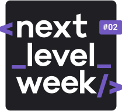

<h1 align="center">
    
</h1>

<h4 align="center"> 
	🧑🏻‍💻 NextLevelWeek 2.0 🚀 In Progress... 🧑🏻‍💻
</h4>

  <a href="#-nlw">Next Level Week</a>&nbsp;&nbsp;&nbsp;|&nbsp;&nbsp;&nbsp;
  <a href="#-project">Project</a>&nbsp;&nbsp;&nbsp;|&nbsp;&nbsp;&nbsp;
  <a href="#rocket-Technologies">Technologies</a>&nbsp;&nbsp;&nbsp;|&nbsp;&nbsp;&nbsp;
  <a href="#-layout">Layout</a>&nbsp;&nbsp;&nbsp;|&nbsp;&nbsp;&nbsp;
  <a href="#-how-to-use">How to use</a>&nbsp;&nbsp;&nbsp;|&nbsp;&nbsp;&nbsp;

## :information_source: What's Next Level Week?

NLW is an online experience with lots of practical content, challenges and hacks that will help you move towards the next level. At NLW you will be guided through our method to learn new tools, get to know new technologies and discover hacks that will boost your career.

## 💻 Project

Proffy is a project developed based on the day of education professionals.
The goal is to connect teachers and students who are interested in private lessons.

<h1 align="center">
    
</h1>

## :rocket: Technologies

This project was developed with the following technologies:

- [Visual Studio Code][vs]
- [HTML 5][html5]
- [CSS 3][css3]
- [JavaScript][javascript]
- [Display Flex][displayflex]
- ...

## 🔖 Layout

To access the layout use [Figma](https://www.figma.com/file/t15Wu4H4mH7zy6EDJezrDL/Proffy-Web-(Copy)?node-id=81%3A666).

💪 Made with by Hygor Martins :wave: [Get in touch!](https://www.linkedin.com/in/hygormartins/)

[html5]: https://developer.mozilla.org/pt-BR/docs/Web/HTML/HTML5
[css3]: https://developer.mozilla.org/pt-BR/docs/Web/CSS
[javascript]: https://developer.mozilla.org/pt-BR/docs/Web/JavaScript
[displayflex]: https://origamid.com/projetos/flexbox-guia-completo/
[vs]: https://code.visualstudio.com/
[vceditconfig]: https://marketplace.visualstudio.com/items?itemName=EditorConfig.EditorConfig
[vceslint]: https://marketplace.visualstudio.com/items?itemName=dbaeumer.vscode-eslint
[prettier]: https://marketplace.visualstudio.com/items?itemName=esbenp.prettier-vscode
